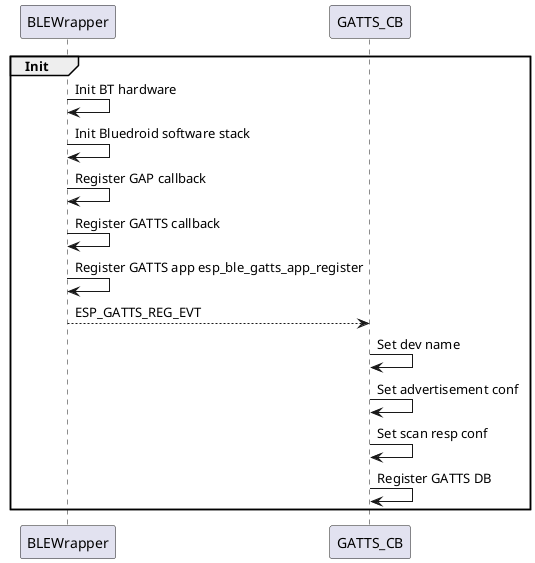
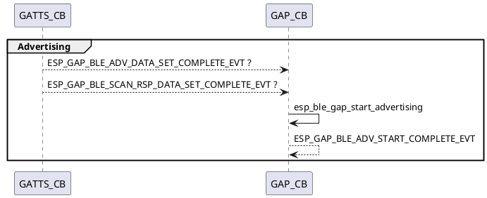
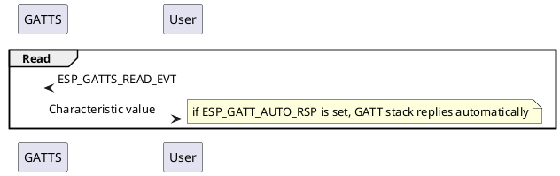

# Setup plantuml in markdown preview
https://blog.anoff.io/2018-07-31-diagrams-with-plantuml/
* Install markdown and plantuml extension
* Install graphviz library
* Set:
    ```
    // PlantUMLServer: Render diagrams by server which is specified with "plantuml.server". It's much faster, but requires a server.
    // Local is the default configuration.
    "plantuml.render": "PlantUMLServer",

    // Plantuml server to generate UML diagrams on-the-fly.
    "plantuml.server": "http://www.plantuml.com/plantuml",
    ```

    Or use local server in the container

# ESP-IDF usage
* cd esp-idf
* . ./export.sh
* cd bike_computer_esp32
* idf.py --ccache -p /dev/ttyUSB0 flash  monitor

# Fonts
## Usage
```
|------------------------|
|  Font42    |  Font19   |
|            |           |
|-------------           |
|  Font31    |           |
|            |           |
|------------------------|
```
- Font19 used for top status bar
- Font24 f.e. in WidgetList
- Font31 in workout selection, while displaying sensor data
- Font42 showing activity selection
- Font56 for splash screens, and welcome
## Adding new ones
- Use this great tool https://kapusta.cc/2020/03/20/fontedit/
- Select Ubuntu mono
- In source code tab
  - Output format C/C++
  - Check reverse bits (MSB)
  - Indentation 4 spaces
  - Remove lut table - save space
  - Add at the bottom following struct
      ```
      sFONT FontX = {
        ubuntu_mono_Zpt,
        Y, /* Width */
        X, /* Height */
      };
      ```
      Where X is height in PIXELS
      Y is width in PIXELS
      Z is height in POINTS

      X and Y can be read from the top of the file in comment section, like:
      ```// Font Size: 16x28px```
      Or in Edit Font tab at the right bottom corner ```Size (adjusted)```


# Bluetooth
* https://www.jaredwolff.com/get-started-with-bluetooth-low-energy/
* https://www.espressif.com/sites/default/files/documentation/esp32_bluetooth_architecture_en.pdf
* https://learn.adafruit.com/introduction-to-bluetooth-low-energy/gatt
* https://punchthrough.com/maximizing-ble-throughput-part-3-data-length-extension-dle-2/
* https://github.com/chegewara/esp32-OTA-over-BLE

## Send big files:
https://github.com/chegewara/esp32-OTA-over-BLE

OTA as an example.
One characteristic with read/write perm:
read: returns available ota version (on second characteristic)
write: create an event that triggers indication on other characteristic

Second characteristic sends indication with payload of max size (ESP_GATT_MAX_ATTR_LEN)
(indication requires ack, notification doesn't)
Indications are send one after another. It waits until ACK is received. Then another indication is
armed.
in ota over ble example both sides sets max MTU

* on connect, update connection params, min, max interval set to 0x6 (fastest), latency 0, timeout 100
* **client** needs to send MTU request in order to have large indications:
I (112615) BT_GATTS: ESP_GATTS_MTU_EVT, MTU 500
* local MTU set to 517 (max)
* Send indication, wait for ACK, send another chunk of data...






```plantuml
group Connect
GATTS <-- User: ESP_GATTS_CONNECT_EVT
GATTS -> GATTS: esp_ble_gap_update_conn_params
GATTS --> GAP_CB: ESP_GAP_BLE_UPDATE_CONN_PARAMS_EVT
end
@enduml

```


# Display selection
## Eink
 * +Low power
 * +Great contrast
 * +White background, love it!
 * -slow refresh
 * -fragile to UV (impossible to do refreshing) - probably some UV filter film would help, who knows?
 * -won't work in cold temperatures
 * -shadowing becomes a problem over time
 * -hard to find good product with reasonable refresh rate and display dimensions
 * -waveform for refreshing the display may be really annoying to watch
## Memory display
- https://www.sharpmemorylcd.com/2-7-inch-memory-lcd.html
- https://ep.com.pl/rynek/wybor-konstruktora/13867-wyswietlacze-najnowsze-technologie
- https://rk.edu.pl/pl/energooszczedne-wyswietlacze-dla-mikrokontrolerow/
- https://learn.adafruit.com/adafruit-sharp-memory-display-breakout/programming?view=all#downloads
- https://github.com/adafruit/Adafruit_SHARP_Memory_Display
- https://github.com/adafruit/Adafruit-GFX-Library
- +Low power
- +Great refresh rate
- +Easy interfacing, no problem with shadowing, waveforms, partial refresh is trivial
- +Very readable in the sunlight
- +Good screen dimensions
- -Hard to read  in darker conditions
- -Whish background be white


# Very Quick & Dirty notes for FIT_SDK
## TODO:
* Familiarize with Scale/Offset feature
* Dynamic Fields
* Components
* Common fields
* Keep in mind while writing the encoder about Best Practices chapter
* While writing Decoder: FIT message conversion chapter, and Plugin Framework chapter
* Download activities from strava and convert them to see the file structure.
## FitCSVTool
Under ```java/FitCSVTool.jar``` allows to decode binary FIT to the CSV.
```
java -jar FitCSVTool.jar
```
## Defining local FIT profile
There is a FitGen.exe binary (can be launched from wine!) which takes messages definitions from config.csv and generates C code. Can be used to reduce binary size. Currently it works only for C, it has no effect on C++.
```
 wine FitGen.exe -c -norewrite
```

## Compiling C example inside FIT module
Changed encode.c code that shows how to create example FIT files. Can be used as a reference for FIT creation on the target. Note encode.c changed to encode.cpp, to allow lambdas in the macro.

```
~/source/esp/bike_computer_esp32/components/FIT/c/examples/encode$

g++ -I../../ ../../fit.c ../../fit_example.c ../../fit_crc.c ../../fit_convert.c encode.cpp
```
## Compilation of FIT_SDK
To compile C:
Make sure ```#define FIT_USE_STDINT_H``` is set in fit_config.h

```
~/Downloads/FIT_SDK/c/examples/encode$
gcc -I../../ ../../fit.c ../../fit_example.c ../../fit_crc.c ../../fit_convert.c encode.c
```

To compile C++:
```
~/Downloads/FIT_SDK/cpp/examples/encode$
g++ -I../../ ../../*.cpp encode.cpp
```


## FIT File definition
Described here: https://developer.garmin.com/fit/protocol/

The data records in the FIT file are the main content and purpose of the FIT protocol. There are two kinds of data records:

* **Definition message**
these define the upcoming data messages. A definition message will define a local message type and associate it to a specific FIT message, and then designate the byte alignment and field contents of the upcoming data message.

* **Data message**
these contain a local message type and populated data fields in the format described by the preceding definition message. The definition message and its associated data messages will have matching **local message types**.

All records contain a __1 byte Record Header__ that indicates whether the Record Content is a definition message, a normal data message or a compressed timestamp data message (Figure 6.b). The lengths of the records vary in size depending on the number and size of fields within them.


All data messages are handled locally, and the definition messages are used to associate local data message types to the global FIT message profile. For example, a definition message may specify that data messages of local message type 0 are Global FIT ‘lap’ messages (Figure 7). The definition message also specifies which of the ‘lap’ fields are included in the data messages (start_time, start_position_lat, start_position_long, end_position_lat, end_position_long), and the format of the data in those fields. __As a result, data messages can be optimized to contain only data, and the local message type is referenced in the header.__ Data messages are referenced to local message type.

### Header
|   Bit   |     Value     |  Description                                         |
|:-------:|:-------------:|------------------------------------------------------|
|    7    |       0       |  Normal Header                                       |
|    6    |     0 or 1    |  Message Type 1: Definition Message 0: Data Message  |
|    5    |  0 (default)  |  Message Type Specific                               |
|    4    |       0       |  Reserved                                            |
|  0 - 3  |     0 - 15    |  Local Message Type                                  |

Compressed header type not described for brevity.

Local message value helps with reducing FIT file size. For example if it's known that some message (like "lap") will be used very often, then create a Message Definition record and set local message to 0 for example. Later in the file (as long as local message is not overwritten by other Message Definition), Data Message refers in it's header to local message == 0. Data Messages can be interleaved with different local message values, as long as Definition Message was written before use.

Example:
```
Definition Message: "lap", local_message = 0, fields,....
Data Message: local_message = 0 ("lap"), data,.....
Data Message: local_message = 0 ("lap"), data,.....
Definition Message: local_message = 1 ("track"), fields,.....
Data Message: local_message = 1 ("track"), data,.....
Data Message: local_message = 0 ("lap"), data,..... // local_message = 0 is already known, no need to write Definition Message once again.
Data Message: local_message = 1 ("track"), data,.....
Data Message: local_message = 1 ("track"), data,.....
Data Message: local_message = 0 ("lap"), data,.....
Data Message: local_message = 0 ("lap"), data,.....
```
Here FIT file contains only two Definition Messages records, no need to write it before every single Data Message.

Header definition implies there can be 16 local messages defined at once. It may happen that FIT file will use more than that. Then Message Definition will have to be overwritten.

### Message types
1) __Definition Message__: this describes the architecture, format, and fields of upcoming data messages
```| Header | Reserved 1byte | Arch 1byte | Global Msg Number 2 bytes | #of fields 1byte | Field definition 3 bytes per field |```

    Optionally, record may be extended after Field definitions with:

    ```|#of Dev fields 1 byte|Dev field definition 3 bytes per field|```

    Definition message associates Global Msg Number from Global FIT profile to the local message (set in the header) in local profile. It additionally selects which fields from Global FIT are used in this local instance, and also, if there is such need, may define developer custom fields.

    Field definition is structured as follows:
    ```| Field def. number 1 byte | Size 1 byte | Base type 1 byte |```

    * Field def. number is the number from global FIT profile
    * Size describes length of the field in bytes. Multiples of it indicates that's an array. That's actually strange, that should be a number of elements of length defined for underlying Base type, not size in bytes.
    * Base type describes which type field holds, what number refers to what type is described in fit.h file. It also describes length in bytes for each type.

        Base type field is destructured further to single bits definition, but is skipped here for brevity.

2) __Data Message__: this contains data that is formatted according to a preceding definition message. A data message must start with a normal or compressed timestamp header indicating its local message type, and the record content must be formatted according to the definition message of matching local message type.


### FIT Messages
Defined and described in
* https://developer.garmin.com/fit/file-types/activity/
* https://developer.garmin.com/fit/file-types/course/
* https://developer.garmin.com/fit/file-types/workout/


# Partition table:
- https://docs.espressif.com/projects/esp-idf/en/latest/esp32/api-guides/partition-tables.html
- https://github.com/espressif/esp-idf/blob/master/examples/storage/spiffs/main/spiffs_example_main.c
